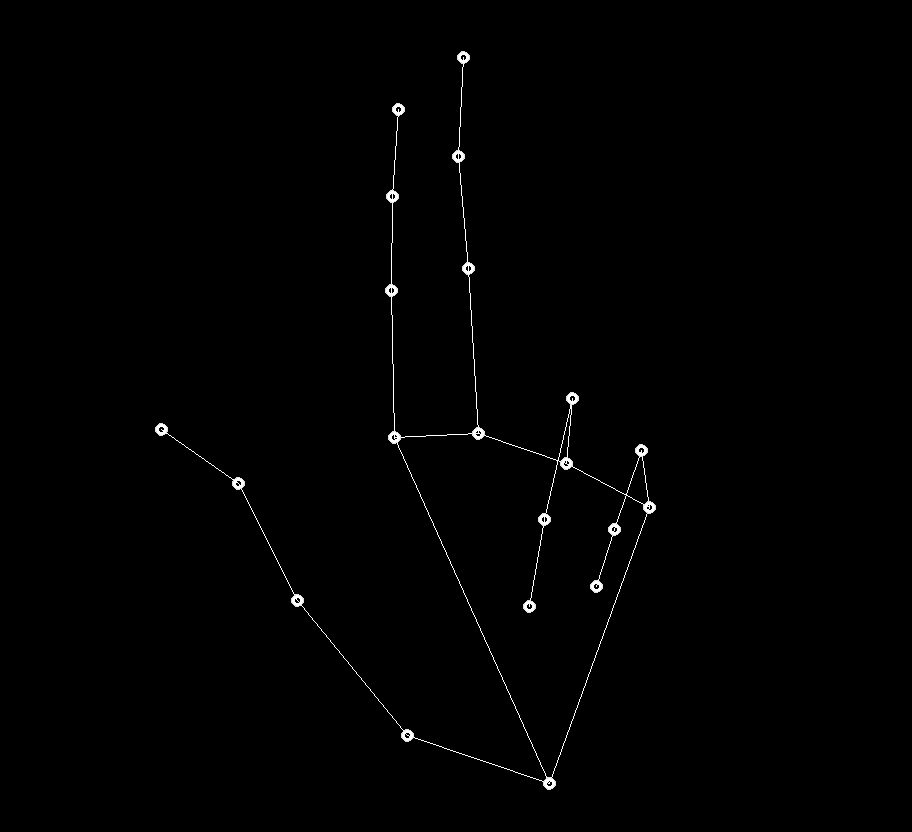

# Hand Cursor

This project aims to let users able to control their device even without mouse

# Instruction
```
pip install -r requirements.txt
```
<b>capture.ipynb -> run all</b>

### Move Cursor
Move your thumb away from your index finger, and control the position of the cursor with the tips of your index finger.



### Left Click
With you have pointed the desired position, stick your thumb with your index finger to freeze the cursor, and left click by bending your index finger


### Right Click
With you have pointed the desired position, stick your thumb with your index finger to freeze the cursor, and right click by bending your middle finger


### Double Click (Doesn't work for mac)
With you have pointed the desired position, stick your thumb with your index finger to freeze the cursor, and double click by bending both of your index and middle finger 


### Terminate
Press Q to terminate the program

# Description
This program utilized mediapipe to locate user's hand coordinate, and capture user's gesture by calculating the distance and angle fo different landmark. 

Preset actions are triggered after captured correesponding gesture.